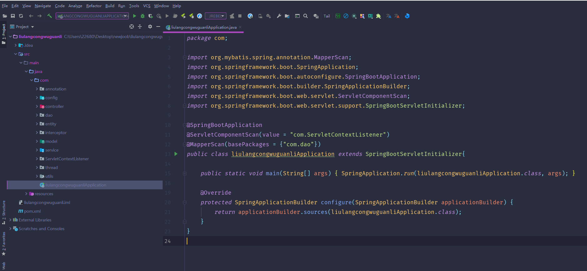
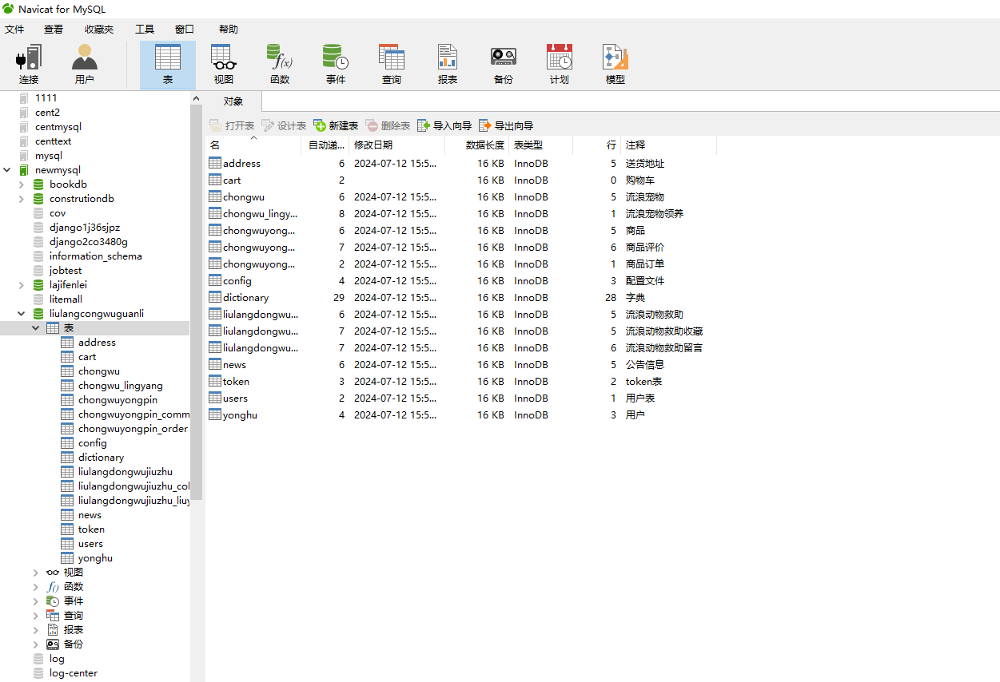
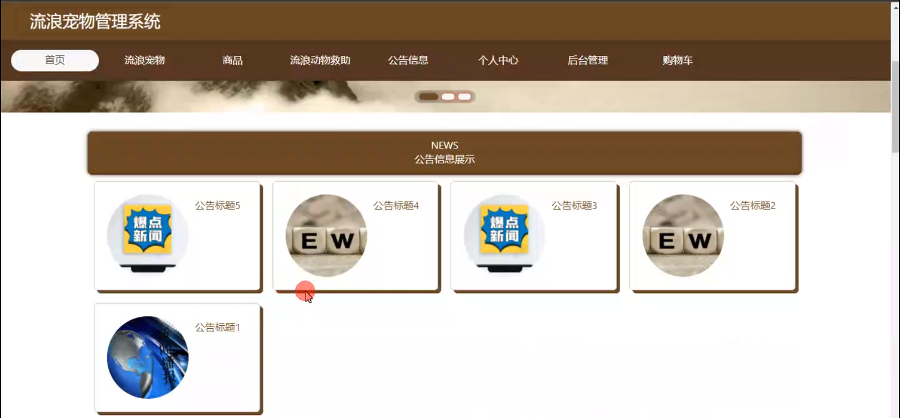
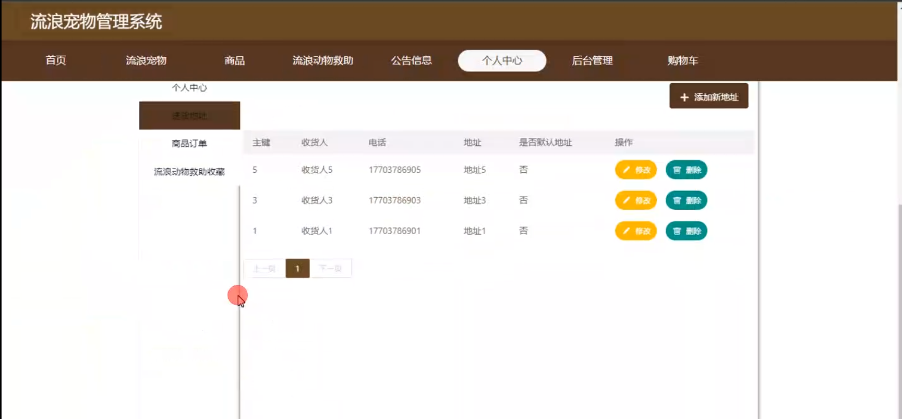
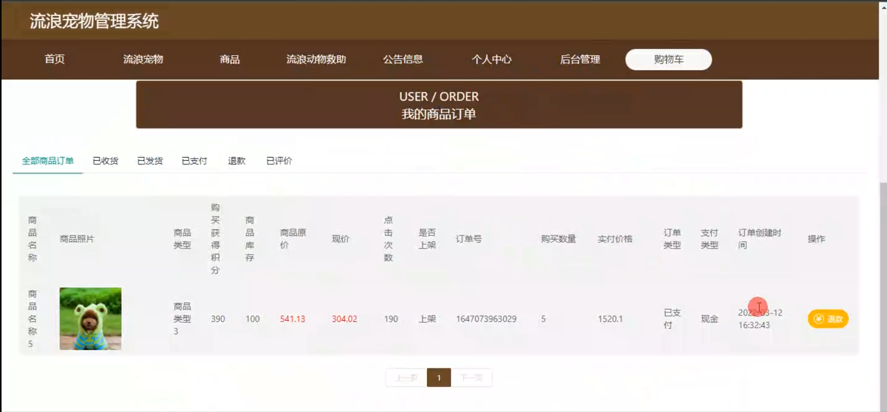
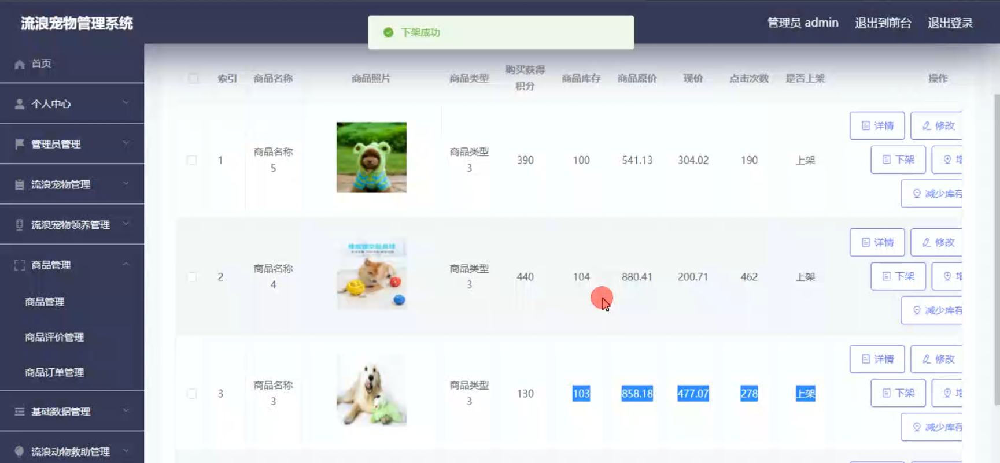
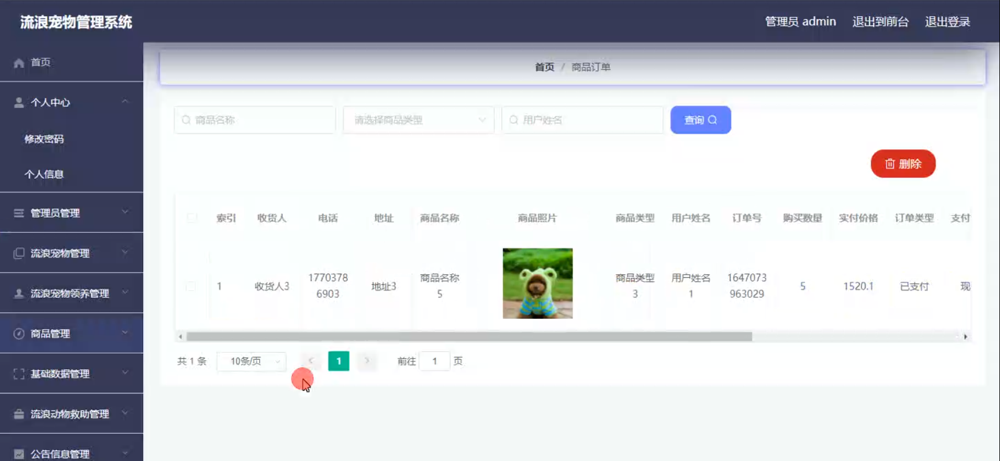
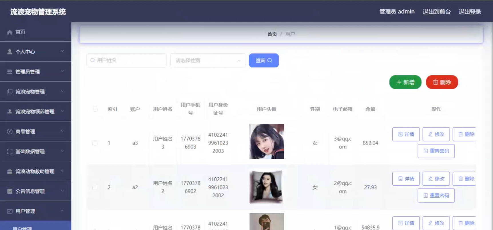
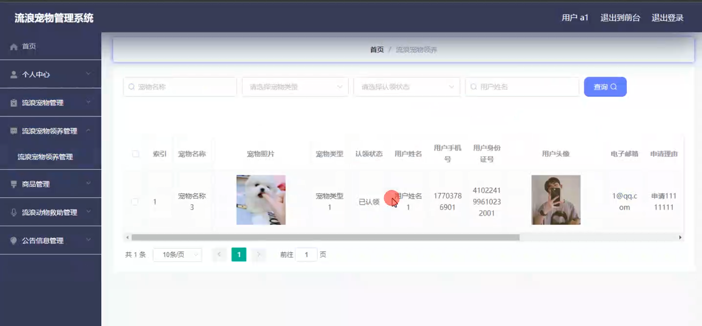
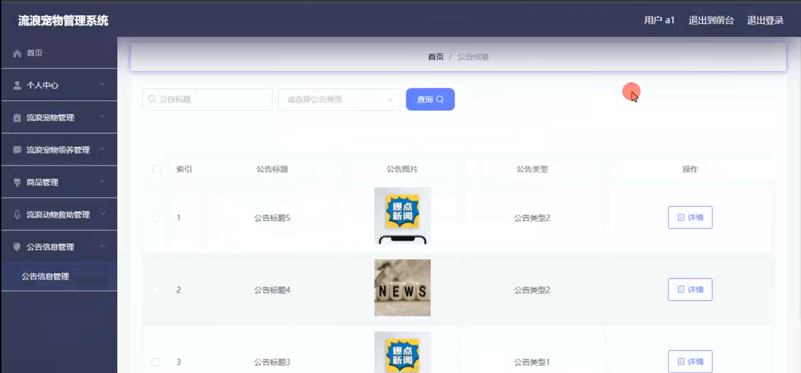

# 基于javaweb的流浪宠物管理系统

<h4 style='color:red'>联系不到我，就看我的主页 </h4> 
 
#### 介绍

随着流浪宠物数量的不断增加，对其进行有效的管理和关爱成为社会关注的焦点。基于 JavaWeb 的流浪宠物管理系统应运而生，旨在为流浪宠物提供更好的照顾和帮助，同时促进宠物领养和救助工作的规范化和高效化。

#### 技术栈

后端技术栈：Springboot+Mysql+Maven

前端技术栈：Vue+Html+Css+Javascript+ElementUI

开发工具：Idea+Vscode+Navicate

#### 系统功能介绍

（一）管理员角色  
个人中心：管理员可在个人中心查看和修改自己的个人信息，以及系统操作记录和通知。  
管理员管理：对其他管理员账号进行添加、删除、修改操作，设置不同管理员的权限和职责。  
流浪宠物管理：详细记录流浪宠物的基本信息，如品种、年龄、性别、健康状况、照片等，并对宠物信息进行更新和维护。  
流浪宠物领养管理：审核领养申请，跟进领养流程，确保流浪宠物能够找到合适的领养家庭。  
商品管理：对与宠物相关的商品进行管理，包括宠物食品、用品、玩具等的上架、下架、库存管理和价格调整。  
基础数据管理：维护系统运行所需的基础数据，如宠物种类、疾病类型、商品分类等。  
流浪动物救助管理：接收和处理流浪动物的救助请求，安排救助工作，跟踪救助后的康复情况。  
公告信息管理：发布有关流浪宠物的最新动态、活动通知、领养政策等信息。  
用户管理：管理用户的注册信息、权限设置、信用评级等，确保用户的合法性和安全性。  
轮播图信息：设置首页的轮播图内容，展示待领养的宠物、重要活动或救助故事等，吸引用户关注。  

（二）用户角色  
流浪宠物：查看流浪宠物的详细信息，了解它们的特点和需求，为领养做准备。  
商品：浏览和购买与宠物相关的商品，为宠物提供生活所需。  
流浪动物救助：了解流浪动物救助的相关信息，支持和参与救助活动。  
公告信息：及时获取系统发布的最新公告，掌握流浪宠物管理的相关政策和动态。  
个人中心：查看个人资料、领养申请记录、购买商品记录等，修改个人信息和密码。  
后台管理  
流浪宠物管理：协助管理员补充和更新流浪宠物的信息。  
流浪宠物领养管理：提交领养申请，查看领养进度。  
商品管理：对购买的商品进行评价和反馈。  
流浪动物救助管理：发起救助请求，跟踪救助进展。  
公告信息管理：查看和分享公告信息。  
购物车：将心仪的商品加入购物车，进行结算和支付。  

#### 系统作用

提高管理效率  
实现流浪宠物信息的数字化管理，减少人工处理的繁琐和错误，提高工作效率。  
促进领养和救助  
为流浪宠物提供更广泛的曝光机会，增加被领养的概率，同时促进社会力量参与流浪动物救助。  
保障宠物福利  
通过规范的管理流程，确保流浪宠物得到适当的照顾、医疗和关爱。  
增强用户参与  
为用户提供便捷的渠道参与流浪宠物相关事务，提高公众的动物保护意识。  
优化资源配置  
合理管理商品和救助资源，提高资源的利用效率和分配公平性。  
建立信任机制  
对用户和领养家庭进行管理和审核，建立信任体系，保障流浪宠物的未来生活质量。  

#### 系统功能截图

代码结构

数据库表

登录

前台页面首页

流浪宠物

商品

流浪动物求助

个人中心

购物车

流浪宠物领养管理

商品管理

商品订单

用户管理

用户端后台管理

公告信息管理

#### 总结

基于 JavaWeb 的流浪宠物管理系统，通过明确管理员和用户的功能模块，为流浪宠物的管理、救助和领养搭建了一个有效的平台。该系统有助于凝聚社会力量，共同为流浪宠物创造更美好的未来，推动动物保护事业的发展。

#### 使用说明

创建数据库，执行数据库脚本 修改jdbc数据库连接参数 下载安装maven依赖jar 启动idea中的springboot项目

前台登录页面
http://localhost:8080/liulangcongwuguanli/front/index.html

后台登录页面
http://localhost:8080/liulangcongwuguanli/admin/dist/index.html

管理员				账户:admin 		密码：admin

用户				账户:a1 		密码：123456